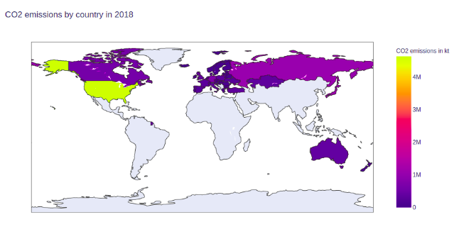
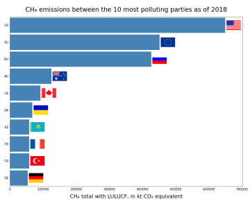
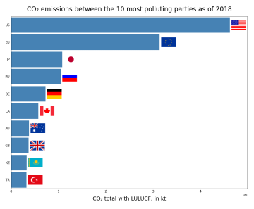
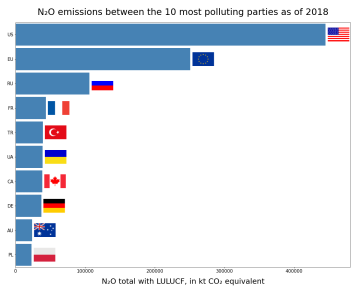
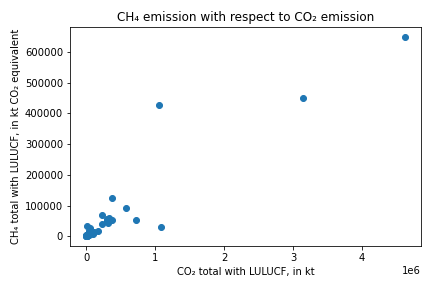
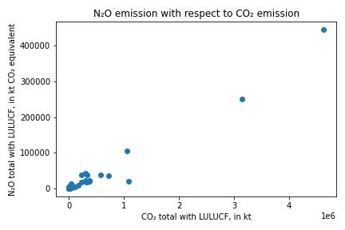
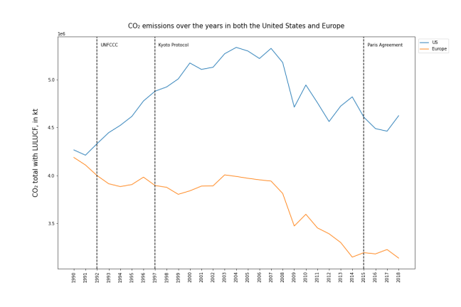
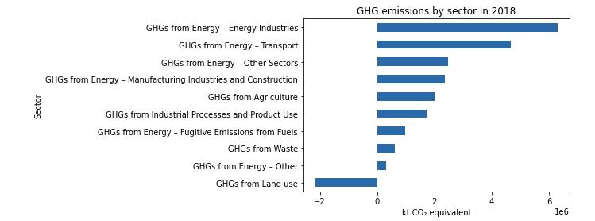

# Milestone 1
## I/ Dataset 

The dataset that we will explore comes from the United Nations Framework Convention on Climate Change (UNFCCC), an international environmental treaty addressing climate change, which ultimate objective is to stabilize greenhouse gas (GHG) concentrations "at a level that would prevent dangerous anthropogenic (human induced) interference with the climate system." The UNFCCC entered into force in 1994. The 197 countries that have ratified the Convention are called Parties to the Convention. [[1]](#references)

Our analysis will focus on the time series module of the GHG dataset [[2]](#references), which consists of national GHG inventories submitted annually by “Annex I Parties'' between 1990 to 2018.  Annex I Parties consist of the industrialized countries that were members of the OECD in 1992, plus countries with economies in transition, including the Russian Federation, the Baltic States, and several Central and Eastern European States. [[3]](#references) “Non-Annex I Parties” are not part of our analysis, as their GHG emissions data are not available for all years of the time series. 

The GHG dataset is divided into 3 main categories, each having multiple elements:
- The *Data for GHG total* category includes GHG total emissions, with and without Land-Use Change and Forestry (LULUCF)
- The *Data by Gas* category includes emission values for CO2, N2O and CH4.
- The *Data by Sector* category includes emission values by industry sector. Industry sectors include Energy, Waste, Fugitive Emissions from Fuels, Industrial Processes and Product Use, Transport, Land use, Land-use Change and Forestry.

The data is well structured and an excel file can be downloaded for each subcategory. As a result, most of the pre-processing and data-cleaning boils down to extracting the information from each Excel file, removing comments and titles and cleaning the numeric values by removing the thousands-separators. We then export the processed files into CSV format, in order for us to be able to explore the dataset and to extract useful information.

## II/ Problematic

Our goal is twofold. On one hand we want to raise awareness about GHG emissions through simple yet visually informative data visualization. On the other hand we want to show the impact of the Kyoto Protocol and the Paris Agreement (which are both extensions of the UNFCCC) in reducing GHG emissions in several countries. The Kyoto Protocol entered into force in 2005 and the Paris agreement in 2016.

By analyzing the data we can see if these two agreements have had an effect on GHG emissions. Additionally, we can observe which countries have effectively reduced their emissions. For the person looking at our visualization, it is a way to learn more about his or her own country and its success in handling the reduction of GHG emissions.

In terms of visualization, we want to add a geographic perspective by showing information on a clickable map or globe. Also, we want to show the evolution of GHG emissions over time as well as their distribution among several industries in such a way that a user could easily find information relevant to him or her.

Our target audience is people of all ages who have an interest in subjects related to climate change and/or the impact of climate change policies and agreements.

To achieve our goal, we plan to display the data in an intuitive manner and provide the user with a great user experience. We want to create a website with simple yet thorough visual interactions accessible to everyone, so that even children could play with it in class along with their professor and become aware of factors affecting climate change. Finally, we want our website to be self explanatory, straightforward, with as little text as possible, so that a busy adult could get the main ideas within a few clicks.

## III/ Exploratory Data Analysis

We have explored our data along two main angles: Data by Gas and Data by Industry. We then analysed this data from different perspectives, such as geographic or evolution over time. We have also explored possible correlations between data points. Below is a summary of our findings: 

### Data by Gas:

- CO2 emissions per country in 2018

The plot below shows the CO2 emissions for each country on a world map. Since the UNFCCC dataset only contains data for Annex I Parties, most of the countries of the southern hemisphere are left blank.

- Comparison of GHGs emissions between Parties

On the following bar charts, we compare and rank the different GHG emissions per Party. We can immediately see that the US is the biggest emitting country, followed by the European Union. 

-  Correlations between different GHG emissions

On the following plots, we explore possible correlations between different GHG emissions for a specific year. To visualize this, we used scatter plots with one type of gas on each axis and each dot representing a country. We can see that the different gas emissions are usually quite correlated, except for a few outliers.

.png)

.png)

- Impact of the climate change agreements

On the following plot, we explore the impact of the 3 climate change agreements on GHG emissions over time for the US and Europe. We compared the CO2 emissions for the US and Europe between 1990 and 2018. We can see that CO2 emissions in the US kept rising until 2006 and started decreasing after that. In Europe, the general tendency was for CO2 emissions to go down.

### Data by Sector:

For this category, we have compared the gas emissions by industry sector.

This bar graph shows that the largest GHG emissions come from the Energy sector, the largest subsection of this sector being the Energy Industries (industries involved in the production and sale of energy). 
On the bottom of the graph, we observe that the GHG emissions values from Land use are negative, meaning that the Land can actually absorb GHGs, which is one of the ways to significantly contribute to mitigation of climate change.

## IV/ Related work 

There are not many online websites that show visualizations of the GHG emissions in relation to the Paris Agreement and the Kyoto Protocol.

We found the *Paris Agreement Tracker* on *CAIT Climate Data Explorer* [[4]](#references). However, the visualized data is very limited. You can only see the current emission values for each country and group of countries, and how close they are to meeting the goal of the agreement. The data provided is only for a single year.

We also found the website *World Resources Institute* [[5]](#references). It contains several pages with plots related to climate change about GHG, deforestation and more. However, the information provided is limited, as most of the time you only see information for a single year. Also, the plots are not intuitive and seem confusing at times, like the plot from *World Greenhouse Gas Emissions: 2016* [[6]](#references).

Regarding the Kyoto Protocol, we found a visualization on the *European Environment Agency* website [[7]](#references). The plot has the same problem as the one for the Paris Agreement. It does not show the evolution of emissions over time. It only shows the target values and how close or distant each country is from reaching them.

We also found some interesting and inspiring visualizations on GHG emissions on *Our World In Data* website [[8]](#references).

Overall, we couldn’t find a website that contained all the information that we want to portray in ours, that had intuitive and good looking visualizations, and showed the progress of emissions over time and how they relate to the agreements.

Part of our general inspiration for this project comes from Youtube channels such as *Kurzgesagt* [[9]](#references) and *TED-Ed* [[10]](#references), which use smart animations and visualizations in a video format to convey in a short amount of time useful information on a large variety of subjects. For an example of such a video, click [here](https://youtu.be/RnvCbquYeIM). 

## References:
- \[1\]: https://unfccc.int/process-and-meetings/the-convention/what-is-the-united-nations-framework-convention-on-climate-change
- \[2\]:  https://unfccc.int/process-and-meetings/transparency-and-reporting/greenhouse-gas-data/ghg-data-unfccc/ghg-data-from-unfccc
- \[3\]: https://unfccc.int/parties-observers
- \[4\]: https://cait.wri.org/indc/#/ratification
- \[5\]: https://www.wri.org/ 
- \[6\]: https://www.wri.org/data/world-greenhouse-gas-emissions-2016
- \[7\]: https://www.eea.europa.eu/data-and-maps/daviz/total-ghg-emissions-and-kyoto#tab-chart_3 
- \[8\]: https://ourworldindata.org/emissions-by-sector
- \[9\]: https://www.youtube.com/user/Kurzgesagt 
- \[10\]: https://www.youtube.com/channel/UCsooa4yRKGN_zEE8iknghZA 

